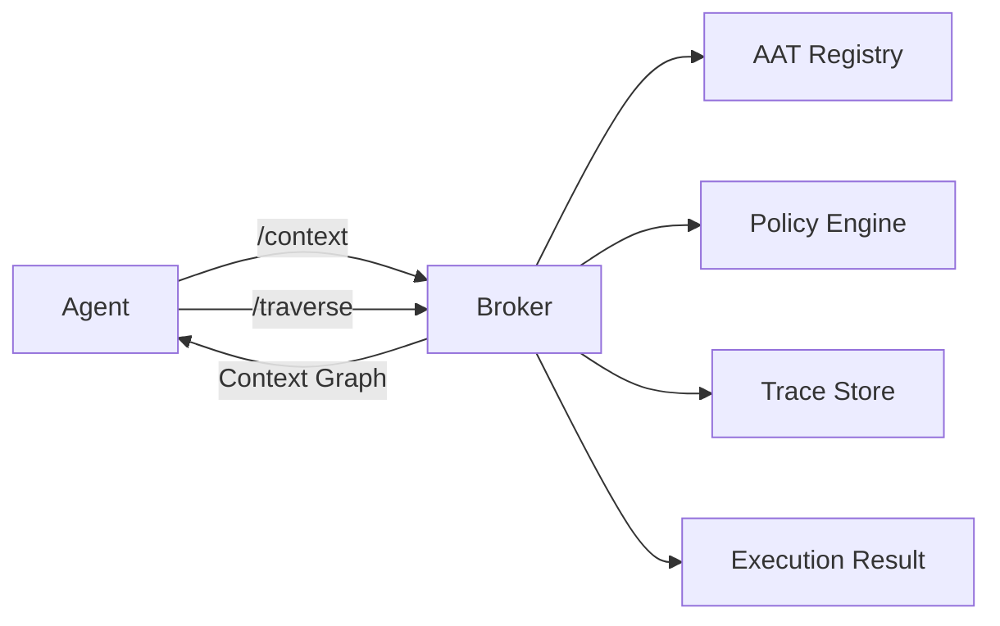
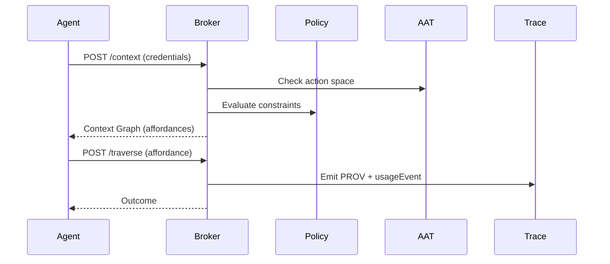

# Project Overview (Implementation)

This repo is the operational implementation of Agent Context Graph (ACG). It turns the foundations contract into running systems, demos, and tests. It is written for principal engineers and engineering managers who need to understand runtime responsibilities, extension points, and operational posture.

## Executive summary

ACG exposes a Context Graph to agents at runtime. The broker generates affordances based on credentials, policies, and current state, and emits PROV traces for every traversal. The implementation respects the foundations contract (schemas, SHACL, ontology, and protocol) and keeps examples and tests aligned with those specs.

## Runtime shape (mermaid)

## Request/trace flow (mermaid)

## How foundations are consumed

The implementation loads schemas and shapes from the foundations repo. If both repos are cloned side by side, the resolver locates them automatically. Otherwise, set ACG_SPEC_DIR to the foundations spec directory.

CI clones the foundations repo and sets ACG_SPEC_DIR so tests and schema validation can run in isolation.

## Repo map

- src/        Core services, broker, orchestrator, and runtime
- examples/   Golden-path examples and demos
- tests/      Unit and integration tests
- guides/     Build and usage guides

## Key entry points (Implementation)

- src/broker/context-broker.ts
- src/agents/orchestrator.ts
- src/dashboard/server.ts
- examples/golden-path/
- tests/integration/golden-path.test.ts

## Operational considerations

- Validation: SHACL and JSON Schema enforce contract compliance.
- Traceability: All traversals emit PROV traces.
- Policy and credential gating: affordances are filtered by policy and VCs.
- Concurrency: AAT rules restrict parallelism and conflict.
- Security: external actions should be isolated and credential-gated.

## Extension points

- Add new AAT definitions in foundations spec/aat.
- Add affordance types in foundations ontology and protocol docs.
- Extend policy rules or AAT composition rules in code.
- Add new demos/examples that conform to the specs.

## Repos

- Foundations: https://github.com/markjspivey-xwisee/agent-context-graph-foundations
- Implementation: https://github.com/markjspivey-xwisee/agent-context-graph-implementation
