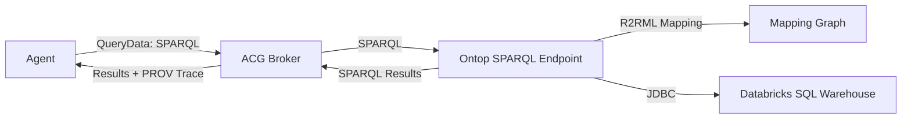

# Ontop Semantic Layer (Zero-copy SPARQL)

This guide wires a **real zero-copy semantic layer** using Ontop. Ontop translates SPARQL
to Databricks SQL using R2RML mappings and the Databricks JDBC driver.

## Architecture (Mermaid)



## Prereqs

1) Download the Databricks JDBC driver (.jar) and place it in:

```
drivers/databricks-jdbc/
```

2) Provide Databricks connection details **at runtime** (prefer secrets/env vars, not repo `.env`).

Example (shell env):

```
export DATABRICKS_HOST=...
export DATABRICKS_HTTP_PATH=...
export DATABRICKS_TOKEN=...
export DATABRICKS_JDBC_DRIVER_CLASS=com.databricks.client.jdbc.Driver
export DATABRICKS_JDBC_USER=token
```

Non-sensitive defaults can still live in `.env`:

```
SEMANTIC_LAYER_SPARQL_ENDPOINT=http://localhost:8080/sparql
```

3) Generate and add `DATABRICKS_JDBC_URL`:

```bash
./scripts/ontop-build-jdbc-url.sh
```

PowerShell:

```powershell
.\scripts\ontop-build-jdbc-url.ps1
```

Copy the printed `DATABRICKS_JDBC_URL='...'` into your runtime env. If you prefer not to export
shell vars directly, store it in a local secrets file outside the repo and reference it when
starting Docker Compose.

If you see `bash: UID: readonly variable` when sourcing `.env`, remove any `UID=...` line and use
`DATABRICKS_JDBC_USER=token` instead.

If you are only using Docker Compose, you can pass env variables inline:

```
DATABRICKS_JDBC_URL=... DATABRICKS_TOKEN=... docker compose --profile semantic-layer up -d ontop
```

## Start Ontop

```
docker compose --profile semantic-layer up -d ontop
```

Default SPARQL endpoint:

```
http://localhost:8080/sparql
```

## Load mappings

Ontop reads the mapping from:

```
${SEMANTIC_LAYER_MAPPING_PATH:-examples/semantic-layer/mapping.ttl}
```

If you want a different Databricks table, you can either edit the mapping file
or generate one at runtime (recommended). The default mapping uses Databricks sample data:

```
SELECT o_orderkey AS order_id, o_orderpriority AS order_name, o_totalprice AS order_revenue
FROM samples.tpch.orders
```

### Runtime mapping refresh (recommended)

The API can introspect Databricks and generate an R2RML mapping dynamically:

```
curl -X POST http://localhost:3000/semantic-layer/refresh \
  -H "Content-Type: application/json" \
  -d '{"catalog":"samples","schema":"tpch","maxTables":20}'
```

Set these in `.env` so Ontop reads the generated mapping:

```
SEMANTIC_LAYER_RUNTIME_DIR=./data/semantic-layer
SEMANTIC_LAYER_MAPPING_PATH=./data/semantic-layer/mapping.ttl
```

Then restart Ontop so it picks up the updated mapping:

```
docker compose --profile semantic-layer restart ontop
```

### Multiple data sources

Each Databricks source can generate its own mapping under:

```
data/semantic-layer/sources/<source-id>/mapping.ttl
```

Ontop loads **one mapping per container**, so for multiple sources you can either:
- Run multiple Ontop instances (one per source), or
- Merge mappings into a single file and point Ontop to that combined mapping.

## Quick SPARQL test

```
curl -X POST http://localhost:8080/sparql \
  -H "Content-Type: application/sparql-query" \
  --data "SELECT * WHERE { ?s ?p ?o } LIMIT 5"
```

## Notes

- Ontop uses environment variables to configure the JDBC connection and mapping file.
- The JDBC URL for Databricks includes `httpPath` and token auth.
