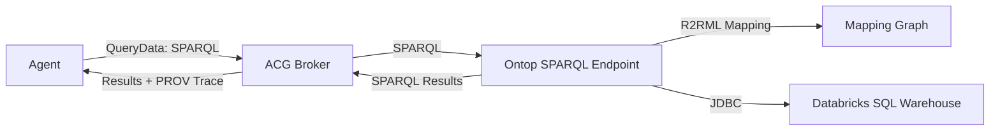

# Ontop Semantic Layer (Zero-copy SPARQL)

This guide wires a **real zero-copy semantic layer** using Ontop. Ontop translates SPARQL
to Databricks SQL using R2RML mappings and the Databricks JDBC driver.

## Architecture (Mermaid)



## Prereqs

1) Download the Databricks JDBC driver (.jar) and place it in:

```
drivers/databricks-jdbc/
```

2) Set these in `.env`:

```
DATABRICKS_HOST=...
DATABRICKS_HTTP_PATH=...
DATABRICKS_TOKEN=...
DATABRICKS_JDBC_DRIVER_CLASS=com.databricks.client.jdbc.Driver
DATABRICKS_JDBC_USER=token
SEMANTIC_LAYER_SPARQL_ENDPOINT=http://localhost:8080/sparql
```

3) Generate and add `DATABRICKS_JDBC_URL`:

```bash
./scripts/ontop-build-jdbc-url.sh
```

PowerShell:

```powershell
.\scripts\ontop-build-jdbc-url.ps1
```

Copy the printed `DATABRICKS_JDBC_URL=...` into your `.env`.

## Start Ontop

```
docker compose --profile semantic-layer up -d ontop
```

Default SPARQL endpoint:

```
http://localhost:8080/sparql
```

## Load mappings

Ontop reads the mapping from:

```
examples/semantic-layer/mapping.ttl
```

If your Databricks table name is different from `sales_orders`, update that mapping file
and restart the Ontop container.

## Quick SPARQL test

```
curl -X POST http://localhost:8080/sparql \
  -H "Content-Type: application/sparql-query" \
  --data "SELECT * WHERE { ?s ?p ?o } LIMIT 5"
```

## Notes

- Ontop uses environment variables to configure the JDBC connection and mapping file.
- The JDBC URL for Databricks includes `httpPath` and token auth.
