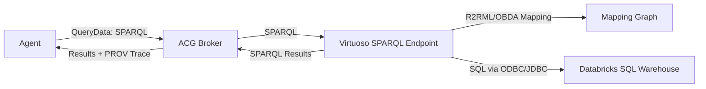

# Virtuoso Semantic Layer (Zero-copy SPARQL)

This guide adds a **real semantic layer service** using Virtuoso Open Source. ACG stays SPARQL-first,
and Databricks remains the source of truth via zero-copy federation.

## Architecture (Mermaid)



## Docker compose (local)

1) Set a DBA password in `.env`:

```
VIRTUOSO_DBA_PASSWORD=change-me
SEMANTIC_LAYER_SPARQL_ENDPOINT=http://localhost:8890/sparql
```

2) Start Virtuoso:

```
docker compose --profile semantic-layer up -d virtuoso
```

3) Confirm SPARQL endpoint:

```
http://localhost:8890/sparql
```

4) Load the R2RML mappings (one command):

```bash
./scripts/virtuoso-load-r2rml.sh
```

PowerShell:

```powershell
.\scripts\virtuoso-load-r2rml.ps1
```

If you see errors like `Undefined procedure DB.DBA.R2RML_MAKE_QM_FROM_G`, install the
**R2RML VAD package** in Virtuoso Conductor, then re-run the loader.

## R2RML mappings (Virtuoso)

Virtuoso supports **R2RML** via the VAD package and can materialize virtual mappings to queryable RDF.
In practice, teams keep **R2RML as the canonical mapping** and apply it in Virtuoso using the built-in
R2RML loader.

If the R2RML VAD package is not present, install it via Virtuoso Conductor:

1) Open the Conductor (`/conductor`) and log in as `dba`.
2) Go to **System Admin → Packages** and install the `r2rml` package.
3) Restart the Virtuoso container.

Minimal flow (interactive):

1) Open ISQL:

```
docker compose exec virtuoso isql 1111 dba
```

2) Load an R2RML mapping graph (paste content, or load from a file if you enable file access):

```
DB.DBA.TTLP('
@prefix rr: <http://www.w3.org/ns/r2rml#> .
@prefix dcat: <http://www.w3.org/ns/dcat#> .
@prefix dcterms: <http://purl.org/dc/terms/> .

<urn:acg:mapping:sales-orders>
  a rr:TriplesMap ;
  rr:logicalTable [ rr:tableName "sales_orders" ] ;
  rr:subjectMap [ rr:template "urn:acg:order/{order_id}" ; rr:class dcat:Dataset ] ;
  rr:predicateObjectMap [ rr:predicate dcterms:identifier ; rr:objectMap [ rr:column "order_id" ] ] .
',
'urn:acg:r2rml:databricks',
'urn:acg:r2rml:databricks');
```

If you mounted the mappings (default compose setup), the file is at:

```
/database/mappings/mapping.ttl
```

3) Generate a quad map from the R2RML graph:

```
EXEC ('SPARQL ' || DB.DBA.R2RML_MAKE_QM_FROM_G('urn:acg:r2rml:databricks'));
```

At this point Virtuoso can resolve SPARQL queries using the mapping.

## Databricks connectivity (zero-copy)

Virtuoso must connect to Databricks via an ODBC/JDBC driver. Ensure the Virtuoso container can access
the driver and DSN. This is an infrastructure concern external to ACG; ACG only talks to the SPARQL endpoint.

## Notes

- Virtuoso provides **RDF Views** (Linked Data Views) for relational mapping and also supports **R2RML**
  for standardized mappings.
- External data source virtualization may require specific Virtuoso editions or drivers depending on
  your Databricks deployment.
