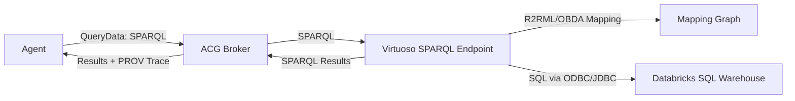

# Virtuoso Semantic Layer (Zero-copy SPARQL)

This guide documents a Virtuoso-based semantic layer. **Virtuoso Open Source cannot attach
external databases**, so zero-copy federation to Databricks requires the commercial edition.
For open-source zero-copy, use Ontop (`SEMANTIC_LAYER_ONTOP.md`).

## Architecture (Mermaid)



## Docker compose (local)

1) Set a DBA password in `.env`:

```
VIRTUOSO_DBA_PASSWORD=change-me
SEMANTIC_LAYER_SPARQL_ENDPOINT=http://localhost:8890/sparql
```

2) Start Virtuoso:

```
docker compose --profile semantic-layer-virtuoso up -d virtuoso
```

If you added the driver mount after Virtuoso was already running, recreate the container:

```
docker compose --profile semantic-layer-virtuoso up -d --force-recreate virtuoso
```

3) Confirm SPARQL endpoint:

```
http://localhost:8890/sparql
```

4) Install the Databricks ODBC driver (one command):

```bash
./scripts/virtuoso-install-databricks-driver.sh
```

PowerShell:

```powershell
.\scripts\virtuoso-install-databricks-driver.ps1
```

5) Configure the Databricks ODBC DSN (one command):

```bash
./scripts/virtuoso-config-databricks-dsn.sh
```

PowerShell:

```powershell
.\scripts\virtuoso-config-databricks-dsn.ps1
```

6) Load the R2RML mappings (one command):

```bash
./scripts/virtuoso-load-r2rml.sh
```

PowerShell:

```powershell
.\scripts\virtuoso-load-r2rml.ps1
```

If you see errors like `Undefined procedure DB.DBA.R2RML_MAKE_QM_FROM_G`, install the
**R2RML VAD package** in Virtuoso Conductor, then re-run the loader.

## Databricks ODBC setup (Virtuoso)

1) Download the Databricks Simba ODBC driver for Linux and place it in
   `drivers/databricks/` (see `drivers/databricks/README.md`).
2) Run `./scripts/virtuoso-install-databricks-driver.sh` to install the driver
   inside the Virtuoso container.
3) Provide Databricks connection settings at **runtime** (prefer secrets/env vars, not repo `.env`):
   - `DATABRICKS_HOST` (workspace host)
   - `DATABRICKS_HTTP_PATH` (SQL warehouse HTTP path)
   - `DATABRICKS_TOKEN` (personal access token)
   - `DATABRICKS_ODBC_DSN` (optional DSN name; default `Databricks`)
   - `DATABRICKS_ODBC_DRIVER_PATH` (optional; default `/opt/simba/spark/lib/64/libSparkODBC_sb64.so`)
4) Run `./scripts/virtuoso-config-databricks-dsn.sh` to write `/etc/odbc.ini`
   and `/etc/odbcinst.ini` inside the container.

## Attach Databricks tables in Virtuoso

The default R2RML mapping uses a SQL query over `samples.tpch.orders`. If you attach a different
Databricks table into Virtuoso, update the mapping to match your attached table or schema.

Suggested flow:

1) Open Virtuoso Conductor (`/conductor`) and log in as `dba`.
2) Navigate to **Database → External Data Sources**.
3) Create a new data source using the DSN name from `DATABRICKS_ODBC_DSN`.
4) Test the connection, then **attach** the target table(s) into `DB.DBA`.
5) Confirm the attached table is visible in Virtuoso SQL, then reload the R2RML mapping.

## R2RML mappings (Virtuoso)

Virtuoso supports **R2RML** via the VAD package and can materialize virtual mappings to queryable RDF.
In practice, teams keep **R2RML as the canonical mapping** and apply it in Virtuoso using the built-in
R2RML loader.

If the R2RML VAD package is not present, install it via Virtuoso Conductor:

1) Open the Conductor (`/conductor`) and log in as `dba`.
2) Go to **System Admin → Packages** and install the `r2rml` package.
3) Restart the Virtuoso container.

Minimal flow (interactive):

1) Open ISQL:

```
docker compose exec virtuoso isql 1111 dba
```

2) Load an R2RML mapping graph (paste content, or load from a file if you enable file access):

```
DB.DBA.TTLP('
@prefix rr: <http://www.w3.org/ns/r2rml#> .
@prefix dcat: <http://www.w3.org/ns/dcat#> .
@prefix dcterms: <http://purl.org/dc/terms/> .

<urn:acg:mapping:sales-orders>
  a rr:TriplesMap ;
  rr:logicalTable [ rr:sqlQuery "SELECT o_orderkey AS order_id, o_orderpriority AS order_name FROM samples.tpch.orders" ] ;
  rr:subjectMap [ rr:template "urn:acg:order/{order_id}" ; rr:class dcat:Dataset ] ;
  rr:predicateObjectMap [ rr:predicate dcterms:identifier ; rr:objectMap [ rr:column "order_id" ] ] .
',
'urn:acg:r2rml:databricks',
'urn:acg:r2rml:databricks');
```

The loader scripts read the mapping from:

```
examples/semantic-layer/mapping.ttl
```

3) Generate a quad map from the R2RML graph:

```
EXEC ('SPARQL ' || DB.DBA.R2RML_MAKE_QM_FROM_G('urn:acg:r2rml:databricks'));
```

At this point Virtuoso can resolve SPARQL queries using the mapping.

## Databricks connectivity (zero-copy)

Virtuoso must connect to Databricks via an ODBC/JDBC driver. Ensure the Virtuoso container can access
the driver and DSN. This is an infrastructure concern external to ACG; ACG only talks to the SPARQL endpoint.

## Notes

- Virtuoso provides **RDF Views** (Linked Data Views) for relational mapping and also supports **R2RML**
  for standardized mappings.
- External data source virtualization may require specific Virtuoso editions or drivers depending on
  your Databricks deployment.
