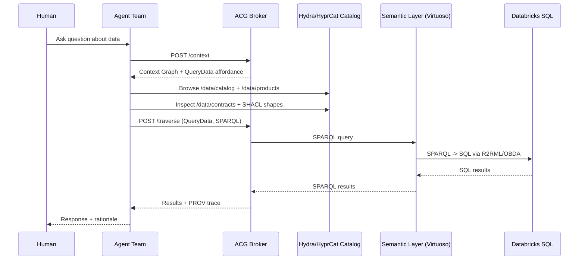

# Databricks Adapter (Example Implementation)

This adapter is **implementation-specific**. The protocol/spec layer is **SPARQL-first**
and does **not** require Databricks.

## Preferred Path: Zero-Copy Semantic Layer

Configure a **virtual zero-copy semantic layer** (e.g., Ontop, Stardog, GraphDB; Virtuoso requires commercial edition for external DBs) that:

- Exposes a **SPARQL endpoint**
- Uses **R2RML/OBDA** mappings over Databricks
- Translates **SPARQL to SQL** at query time (no data replication)
- Publishes **HyprCat-aligned** DCAT/DPROD metadata, Hydra affordances, and SHACL contracts

Set:

- `SEMANTIC_LAYER_SPARQL_ENDPOINT`

Then use `QueryData` with `queryLanguage: "sparql"`.

For Virtuoso setup, see `guides/SEMANTIC_LAYER_VIRTUOSO.md`.
For Ontop setup, see `guides/SEMANTIC_LAYER_ONTOP.md`.

### Runtime introspection + dynamic mappings (recommended)

To avoid hardcoding tables or mappings, the implementation can **introspect Databricks at runtime** and
generate an R2RML mapping on demand.

API endpoint:

```
POST /semantic-layer/refresh
```

Example payload:

```json
{
  "catalog": "samples",
  "schema": "tpch",
  "maxTables": 20
}
```

This will:
1) Inspect `system.information_schema` for tables/columns.
2) Generate a runtime `mapping.ttl`.
3) Emit a Hydra/HyprCat catalog (`/data/catalog`, `/data/products`).

Set env vars for defaults:

```
SEMANTIC_LAYER_RUNTIME_DIR=./data/semantic-layer
SEMANTIC_LAYER_MAPPING_PATH=./data/semantic-layer/mapping.ttl
SEMANTIC_LAYER_MAPPING_CATALOG=samples
SEMANTIC_LAYER_MAPPING_SCHEMA=tpch
SEMANTIC_LAYER_MAPPING_MAX_TABLES=50
```

Then trigger:

```
curl -X POST http://localhost:3000/semantic-layer/refresh
```

Ontop still needs to read the mapping file you generated, but **the mapping content is now runtime-derived**
instead of hardcoded.

### Zero-copy guarantee

The semantic layer is a **virtual RDF overlay**. Databricks remains the source of truth, and
all SPARQL queries are **federated/mapped** to SQL against Databricks at runtime via R2RML.
No data is copied or persisted into the ACG runtime.

## Agent chat flow (Databricks example)

Below is the **intended multi-agent flow** when a human chats about Databricks-backed data.
This is the same ACG runtime pattern used for any source; Databricks is only the adapter example.

Use the dashboard **Chat** tab or call `POST /chat` on the dashboard server to invoke this flow.



1) **Human prompt** (e.g., “Show revenue trends by region for Q3”).
2) **Planner/Analyst agent requests context** via `POST /context`.
   - The broker returns a **Context Graph** with a `QueryData` affordance, policy constraints,
     and references to the **Knowledge Graph** and semantic catalog.
3) **Catalog discovery** (Hydra + HyprCat):
   - Agents browse `GET /data/catalog` and `GET /data/products` to locate the relevant data product
     (DCAT/DPROD metadata, ownership, lineage).
4) **Contract alignment** (SHACL):
   - Agents read `GET /data/contracts/{id}` and `GET /data/contracts/{id}/shape` to understand
     required shapes, units, and validation constraints before querying.
5) **Semantic query** (canonical):
   - The agent traverses `QueryData` with `queryLanguage: "sparql"` and a SPARQL query targeting
     the selected data product.
   - The **virtual semantic layer** translates SPARQL → Databricks SQL at runtime via R2RML/OBDA.
6) **Results + traceability**:
   - The broker returns results and emits **PROV traces** for the traversal.
   - Usage semantics can be updated from traces to capture how affordances are used over time.
7) **Follow-up questions / refinement**:
   - The team of agents iterates with updated queries, using the same Context Graph constraints,
     and the human sees responses grounded in the semantic layer.

This flow keeps the **protocol SPARQL-first** while preserving Databricks as the operational system
of record.

## SQL Adapter (Fallback / Dev)

If you want direct SQL execution (adapter extension), configure:

- `DATABRICKS_HOST`
- `DATABRICKS_TOKEN`
- `DATABRICKS_WAREHOUSE_ID` (optional)
- `DATABRICKS_CATALOG` (optional)
- `DATABRICKS_SCHEMA` (optional)

Then use `QueryData` with `queryLanguage: "sql"` (implementation extension).

## Notes

Databricks is only one possible adapter. Any SQL warehouse or data system can be integrated
so long as the semantic layer exposes a SPARQL endpoint and mappings are explicit.
